# 🌸 Ma-Eternal – Care. Comfort. Confidence.
*A Maternal Health & Wellness Web App*

**Ma-Eternal** is a responsive, empathetic, and privacy-first web application designed to support women throughout their reproductive health journey — from menstruation and ovulation to pregnancy and postpartum well-being.

With cycle tracking, pregnancy insights, nutrition guidance, mental wellness tools, and an AI-powered assistant, the platform creates a **safe, judgment-free digital space** for women to understand and care for their health.

---

## 🎯 Project Objective

To build an **accessible, user-friendly, and emotionally supportive maternal health platform** using a **front-end–focused architecture**, enabling users to:

- Track menstrual cycles and ovulation  
- Monitor pregnancy progress  
- Log symptoms, moods, and wellness data  
- Receive calm, non-medical self-care guidance  

—all through a comforting, inclusive interface.

---

## 🚀 Live Demo

🔗 **Website:** https://ma-eternal-blush.vercel.app/  
🎥 **Demo Video:** https://youtu.be/iN_0Txvz6HE?si=GnIIPgk228kauFEV

---

## 🖥️ Tech Stack

- **Frontend:** HTML5, CSS3, JavaScript  
- **UI Framework:** Lovable.dev (component-based UI generation)  
- **AI Assistant:** Google Gemini API  
- **Styling:** Soft UI, warm pastel palette, accessibility-first layouts  
- **Architecture:** Modular, mobile-first component structure  
- **Backend:** *Not required for core functionality*

---
## 📸 Screenshots

### 🏠 Home / Landing Page
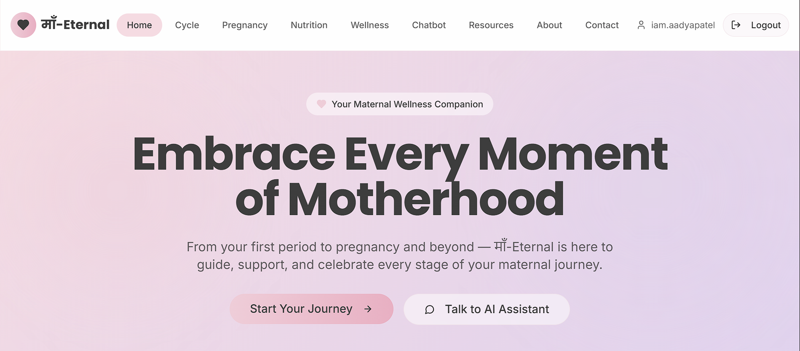
*Embrace Every Moment of Motherhood*  
Your trusted digital companion from first period to pregnancy and beyond.

---

### ⭐ Platform Highlights
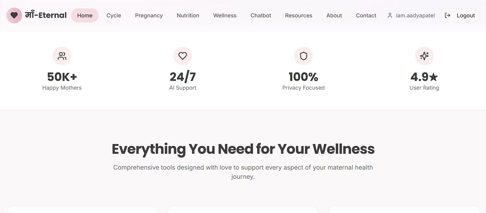
*Trusted, Private, and Always There for You*  
24/7 AI support with a privacy-first approach for maternal wellness.

---

### 🧰 Core Wellness Tools
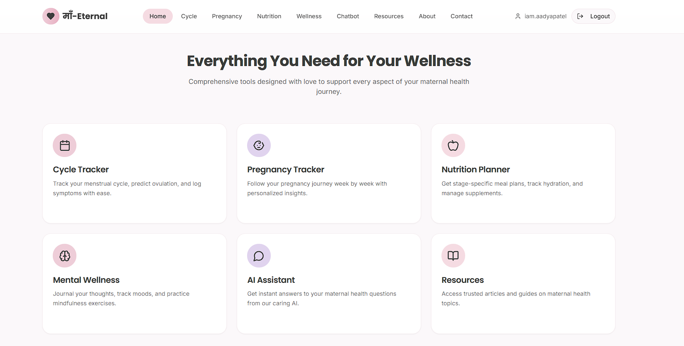
*Everything You Need for Your Wellness*  
Comprehensive tools designed to support every stage of maternal health.

---

### 🧩 Wellness Modules

*Designed with Care for Every Maternal Need*  
From cycle tracking to mental wellness — all in one place.

---

## 🩸 Cycle & Pregnancy Tracking

### 🩸 CycleSense — Period Tracker

*Understand Your Cycle with Confidence*  
Track periods, predict ovulation, and log symptoms effortlessly.

---

### 🤰 BabyBloom — Pregnancy Setup
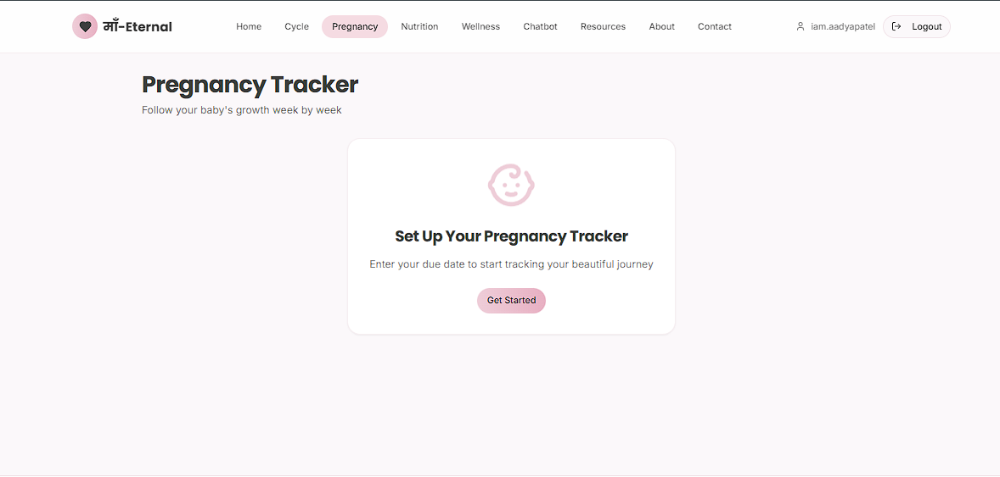
*Start Tracking Your Pregnancy Journey*  
Personalized insights begin with your due date.

---

### 👶 BabyBloom — Pregnancy Progress
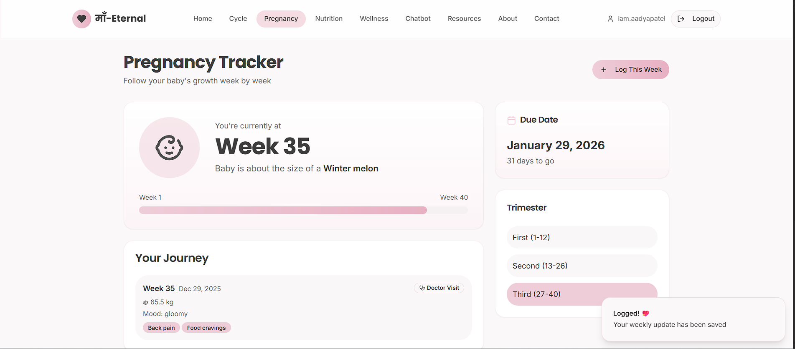
*Your Baby’s Growth, Week by Week*  
Visual milestones, trimester insights, and weekly logs.

---

## 🍽️ Nutrition & Wellness

### 🍽️ NutriNest — Nutrition Planner
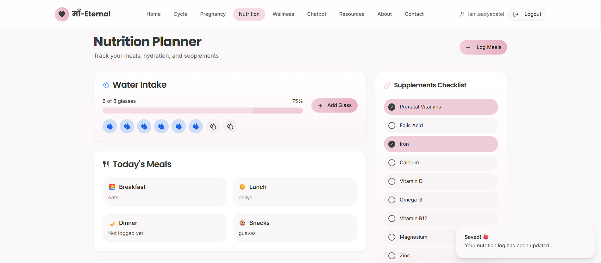
*Nourishment Tailored to Your Journey*  
Track meals, hydration, and supplements with ease.

---

### 🥗 Smart Nutrition Guidance
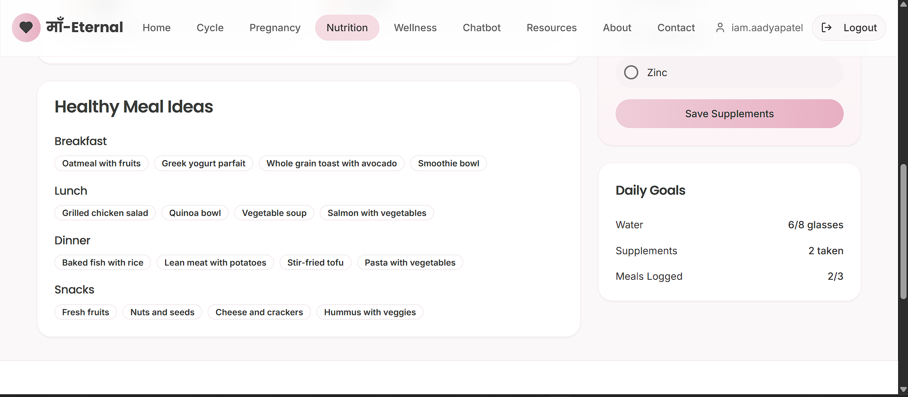
*Healthy Meal Ideas for Every Day*  
Balanced meal suggestions aligned with maternal needs.

---

## 🧘 Mental Wellness

### 🌿 Mental Wellness Dashboard
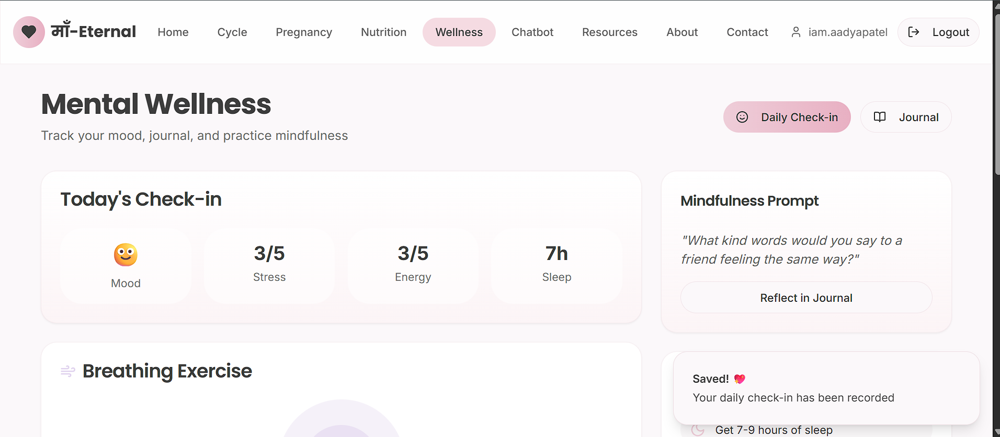
Track your mood, stress, energy, and sleep with daily emotional check-ins.

---

### 🧠 Mindfulness & Breathing Exercise
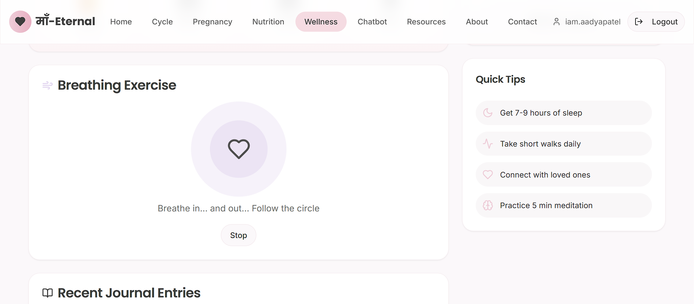
Guided breathing exercises to reduce stress and promote calmness.

---

### 📖 Mood Journal
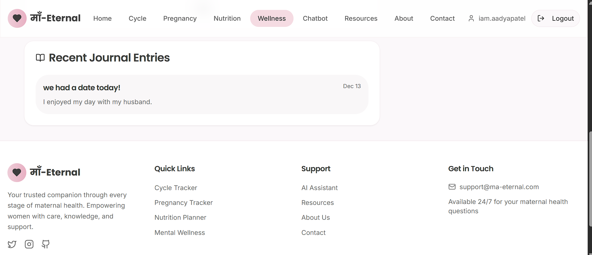
Reflect on your thoughts and emotions through private journaling.

---

## 💬 AI Support

### 🤖 MamaAI — Maternal Health Assistant
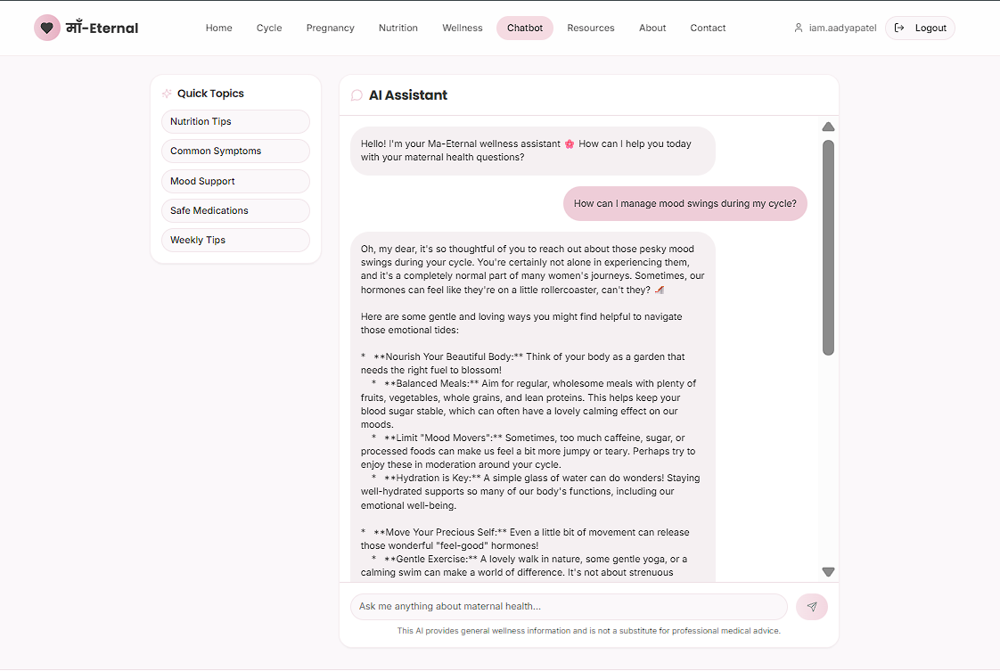
A caring, non-judgmental AI companion for maternal wellness questions and guidance.

---

## 📚 Resources & Trust

### 📘 Health Resources & Emergency Support
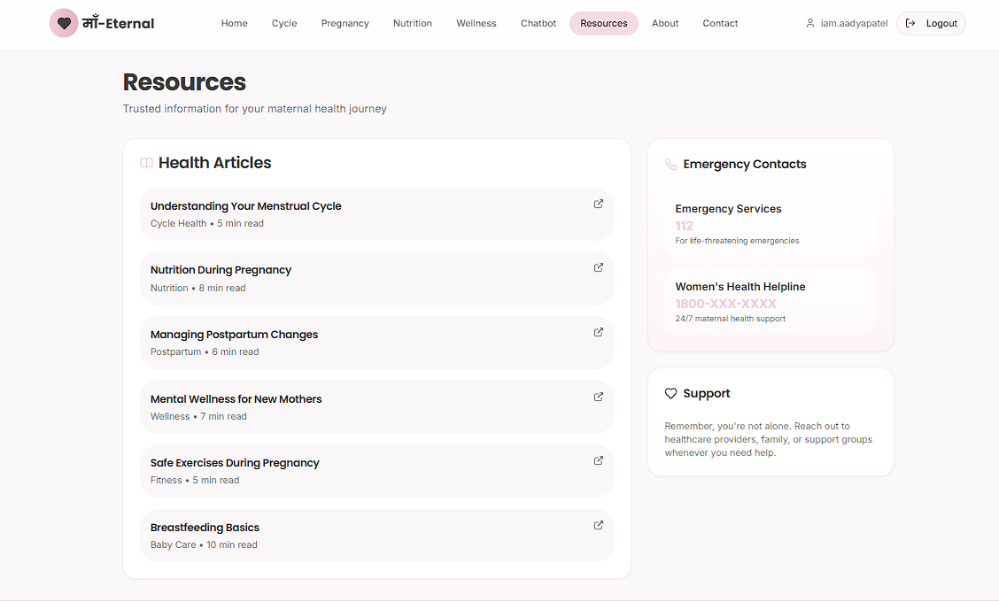
Trusted articles, emergency contacts, and wellness information for every stage.

---

## ℹ️ About & Contact

### 💖 About Ma-Eternal
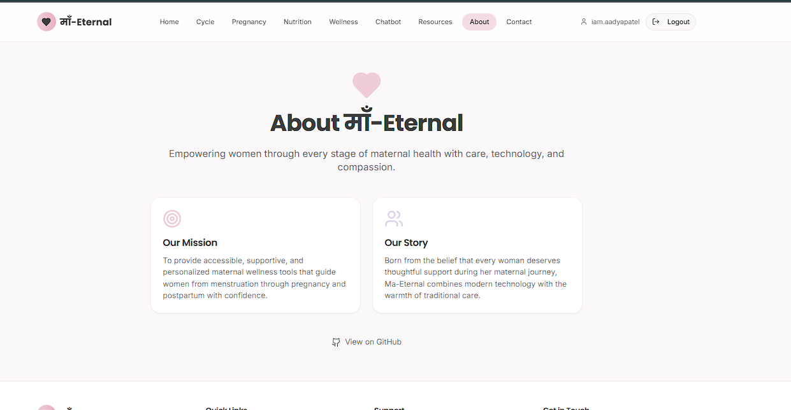
Learn about our mission, story, and commitment to compassionate maternal care.

---

### ✉️ Contact Us
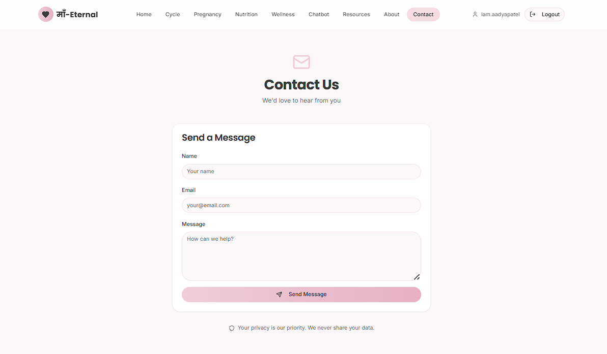
Reach out for support, feedback, or questions — your privacy is our priority.

---

## 🔐 Authentication

### 🔑 Login
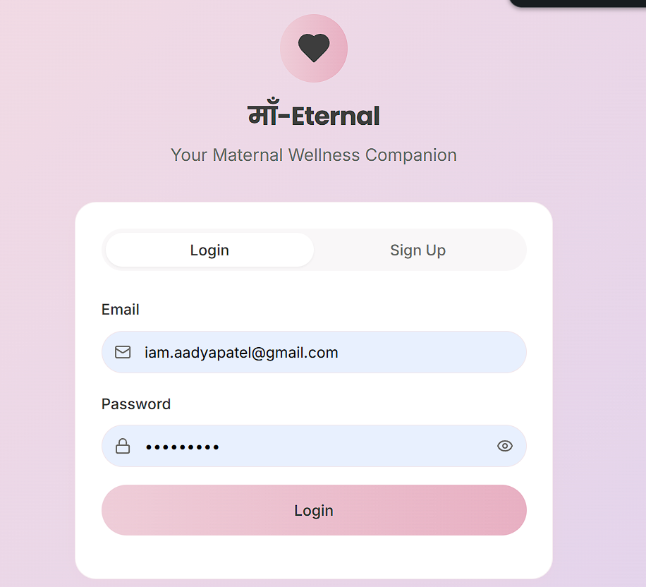
Secure login to access your personalized maternal wellness dashboard.

---

### 📝 Sign Up
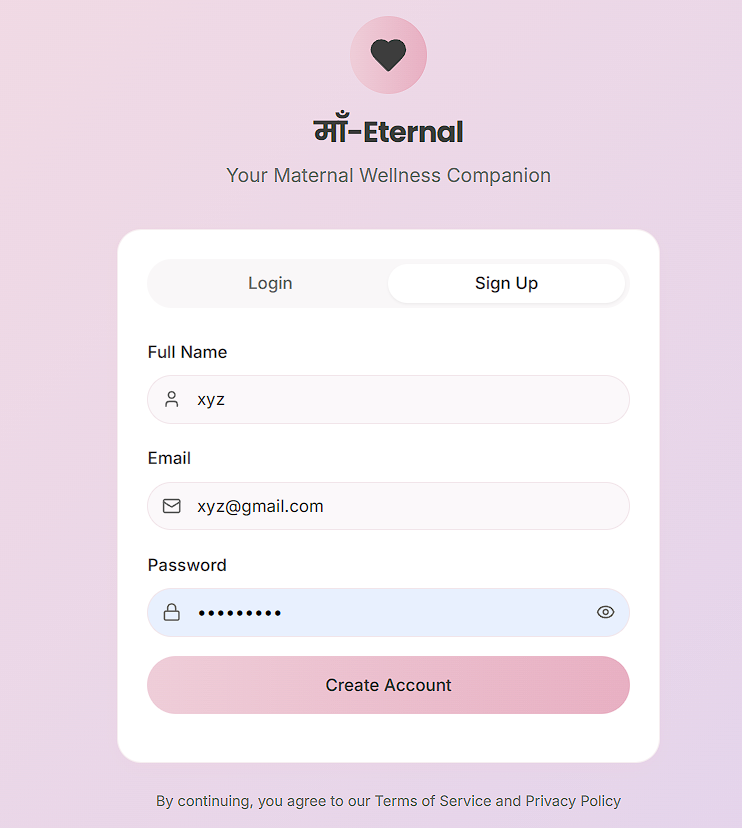
Create a free account to begin your maternal wellness journey.

---

### 🔒 Account Creation

Simple and secure onboarding designed with user comfort in mind.

---

### 🚀 Get Started
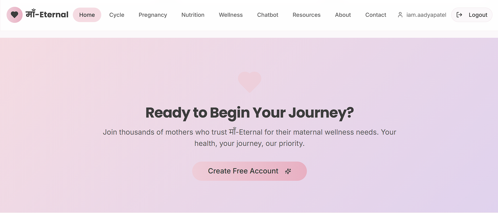
*Ready to Begin Your Journey?*  
Join thousands of women prioritizing their health with Ma-Eternal.

---

### 🛟 Support & Footer
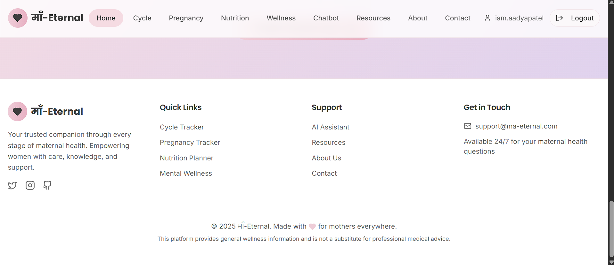
*Here for You, Always*  
Trusted resources, AI support, and guidance whenever you need it.

---

## 📁 Folder Structure

```
.
├── .env
├── .gitignore
├── bun.lockb
├── components.json
├── eslint.config.js
├── index.html
├── package-lock.json
├── package.json
├── postcss.config.js
├── tailwind.config.ts
├── tsconfig.app.json
├── tsconfig.json
├── tsconfig.node.json
├──  vite.config.ts
└── README.md # This file
```

---

## ⚙️ Setup Instructions

### 1. Clone the Repository

```
git clone https://github.com/your-username/ma-eternal.git
cd ma-eternal
```

### 2. Run Locally

Option 1:
Open `index.html` directly in your browser.

Option 2 (Recommended):
Use Live Server for auto-refresh:

```
npm install -g live-server
live-server
```
## 🌍 Deployment (Vercel)

1. Push the repository to GitHub  
2. Go to **Vercel → New Project**  
3. Select your repository  
4. Framework: **Other**  
5. Root Directory: `/`  
6. Click **Deploy**

🚀 Your site will be live within seconds.

---

## 👥 Contributors

| Team Member | Role |
|------------|------|
| **@aadya2901** | AI Integration, UX Design, Frontend Architecture, Deployment |
| **@ananyamishra13** | Page Development, UI Components, Output Sections |
| **@iam-anish15** | UI Styling, Visual Design, Frontend Enhancements |

---

## 🤝 Contributing

We welcome suggestions and improvements:

1. Fork the repository  
2. Create a feature branch  
3. Commit your changes  
4. Push the branch  
5. Open a Pull Request  

---

## 📝 License

This project is licensed under the **MIT License**.

---

## 💬 Final Note

> **“Empowering women with comfort, confidence, and compassionate digital care.”** 🌸

