# 🌸 Ma-Eternal – Care. Comfort. Confidence.
*A Compassionate Maternal Health & Wellness Web App*

**Ma-Eternal** is a responsive, privacy-first maternal health and wellness web application designed to support women across every stage of their reproductive journey — from menstruation and ovulation to pregnancy, mental well-being, and self-care.

Instead of overwhelming users with clinical jargon or rigid medical workflows, Ma-Eternal focuses on **empathy, accessibility, emotional safety, and awareness**, helping women better understand their bodies while encouraging informed and mindful health decisions.

> ⚠️ **Disclaimer:** Ma-Eternal is **not a medical or diagnostic platform**.  
> It provides general wellness insights and self-care guidance and does **not replace professional medical advice**.

---

## 🎯 Project Objective

To build an **accessible, inclusive, and emotionally supportive maternal wellness platform** that empowers women to:

- Track menstrual cycles and ovulation effortlessly  
- Monitor pregnancy progress week by week  
- Maintain nutrition, hydration, and supplement routines  
- Reflect on mood, stress, and mental wellness  
- Receive **AI-powered, non-diagnostic wellness guidance**  
- Feel supported in knowing **when to seek professional care**

The goal is **confidence and comfort — not diagnosis**.

---

## 🚀 Live Demo

🔗 **Website:** https://ma-eternal-blush.vercel.app/  
🔗 **Website:** v0-ma-eternal.vercel.app/
🎥 **Demo Video:** https://youtu.be/iN_0Txvz6HE

---

## 🖥️ Tech Stack

### Frontend
- HTML5  
- CSS3  
- JavaScript  
- TypeScript  
- Vite  

### Styling & UI
- Tailwind CSS  
- Mobile-first, responsive design  
- Soft pastel color palette  
- Accessibility-focused typography and spacing  

### AI & Intelligence
- **Google Gemini API** – maternal wellness guidance, explanations, and conversational support  

### Architecture
- Frontend-focused, modular component design  
- No backend required for core functionality  

### Deployment
- **Vercel**

---

## 🌟 Key Features

### 🩸 CycleSense — Period & Ovulation Tracking
- Predict menstrual cycles and fertile windows  
- Log symptoms, moods, cravings, and energy levels  
- Clear visual calendar for easy understanding  

### 🤰 BabyBloom — Pregnancy Tracking
- Week-by-week pregnancy progress visualization  
- Trimester identification and milestones  
- Due date countdown and weekly logs  

### 🍽️ NutriNest — Nutrition Planner
- Meal logging for breakfast, lunch, dinner, and snacks  
- Hydration tracking with daily goals  
- Supplement checklist for pregnancy nutrition  

### 🧘 MindEase — Mental Wellness
- Daily emotional check-ins (mood, stress, energy, sleep)  
- Guided breathing exercises  
- Private mood journaling for reflection  

### 💬 MamaAI — AI Wellness Assistant
- Calm, empathetic responses to maternal health questions  
- Non-judgmental and easy-to-understand explanations  
- Encourages monitoring vs professional consultation when needed  
- Powered by **Google Gemini API**

### 🔐 Privacy-First by Design
- Optional login  
- Minimal sensitive data usage  
- No forced data persistence  
- User-controlled wellness logs  

---
## 📸 Screenshots

### 🏠 Home
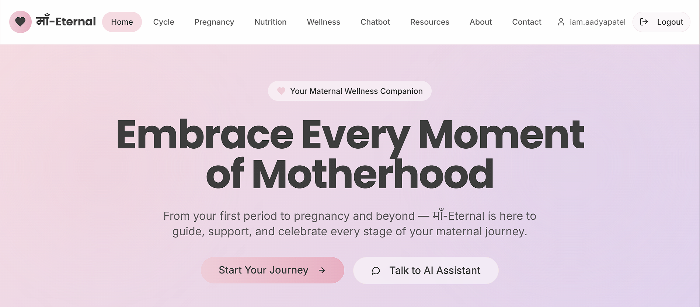
*Embrace Every Moment of Motherhood*  
Your trusted digital companion from first period to pregnancy and beyond.

### ⭐ Platform Highlights
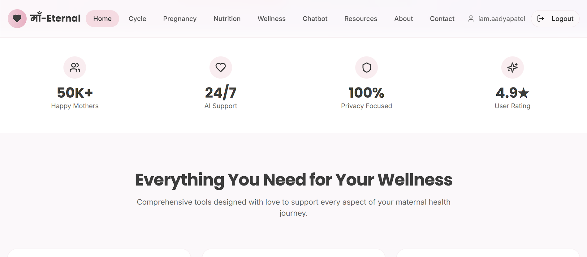
*Trusted, Private, and Always There for You*  
24/7 AI support with a privacy-first approach for maternal wellness.

### 🧰 Core Wellness Tools
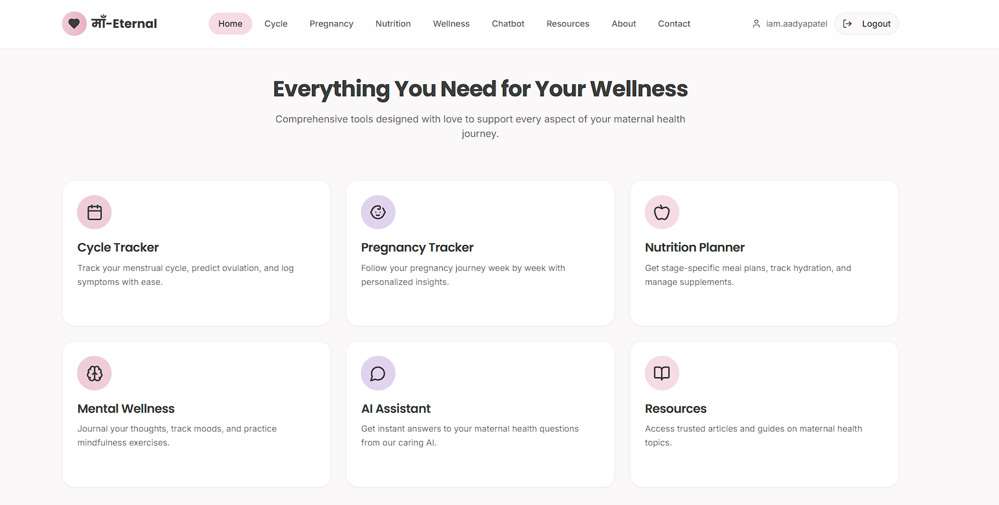
*Everything You Need for Your Wellness*  
Comprehensive tools designed to support every stage of maternal health.

### 🧩 Wellness Modules
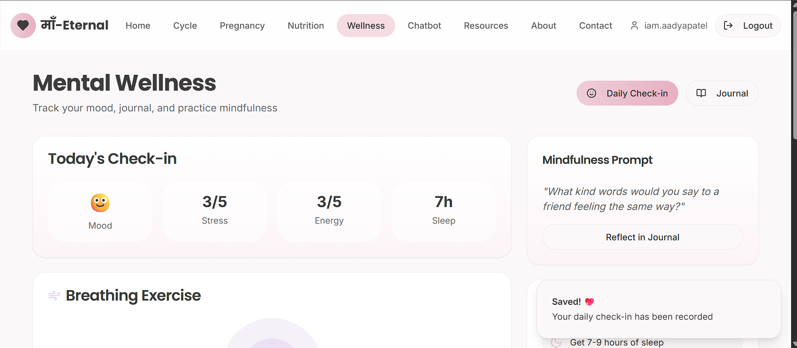
*Designed with Care for Every Maternal Need*  
From cycle tracking to mental wellness — all in one place.

---

## 🩸 Cycle & Pregnancy Tracking

### 🩸 CycleSense — Period Tracker
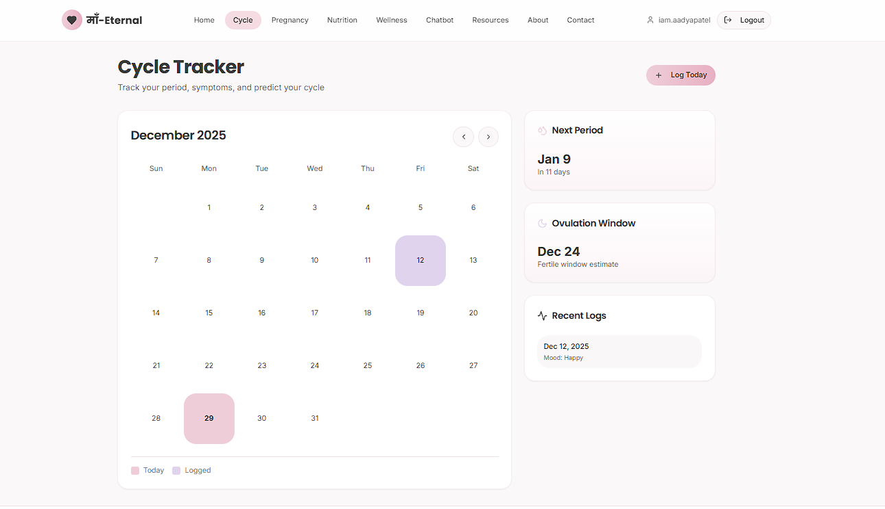
*Understand Your Cycle with Confidence*  
Track periods, predict ovulation, and log symptoms effortlessly.

### 🤰 BabyBloom — Pregnancy Setup
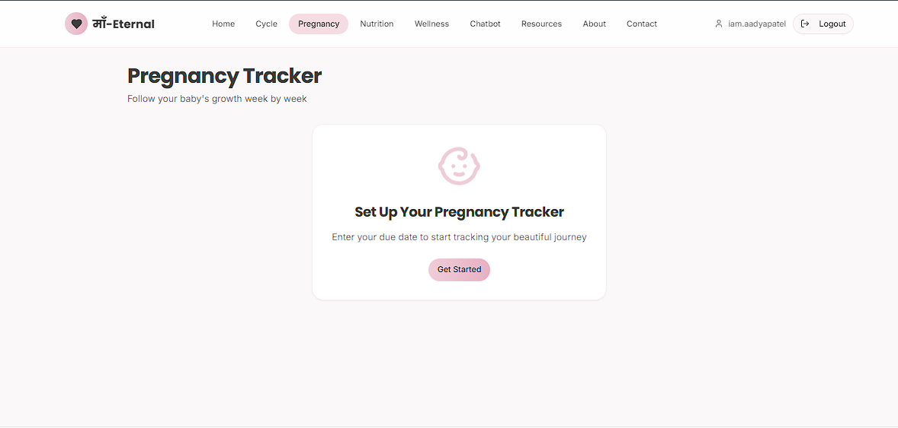
*Start Tracking Your Pregnancy Journey*  
Personalized insights begin with your due date.

### 👶 BabyBloom — Pregnancy Progress
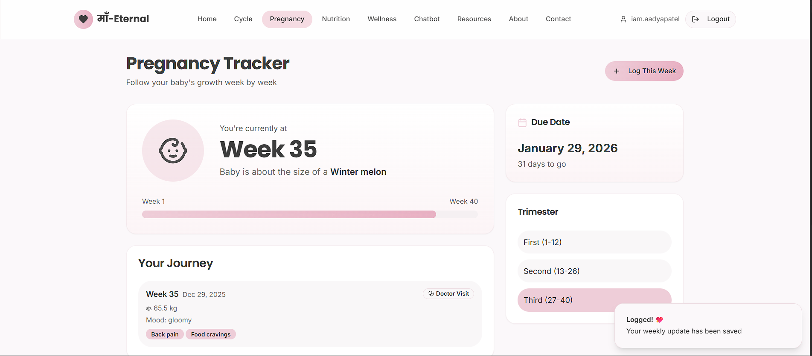
*Your Baby’s Growth, Week by Week*  
Visual milestones, trimester insights, and weekly logs.

---

## 🍽️ Nutrition & Wellness

### 🍽️ NutriNest — Nutrition Planner
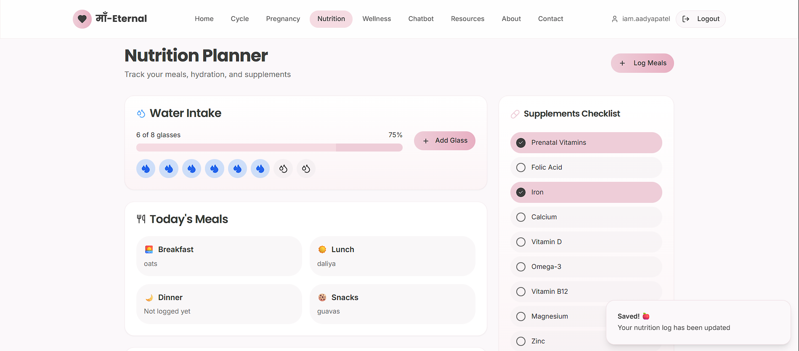
*Nourishment Tailored to Your Journey*  
Track meals, hydration, and supplements with ease.

### 🥗 Smart Nutrition Guidance
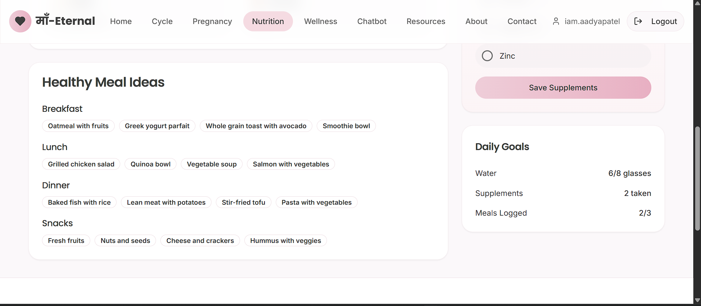
*Healthy Meal Ideas for Every Day*  
Balanced meal suggestions aligned with maternal needs.

---

## 🧘 Mental Wellness

### 🌿 Mental Wellness Dashboard

Track your mood, stress, energy, and sleep with daily emotional check-ins.

### 🧠 Mindfulness & Breathing Exercise
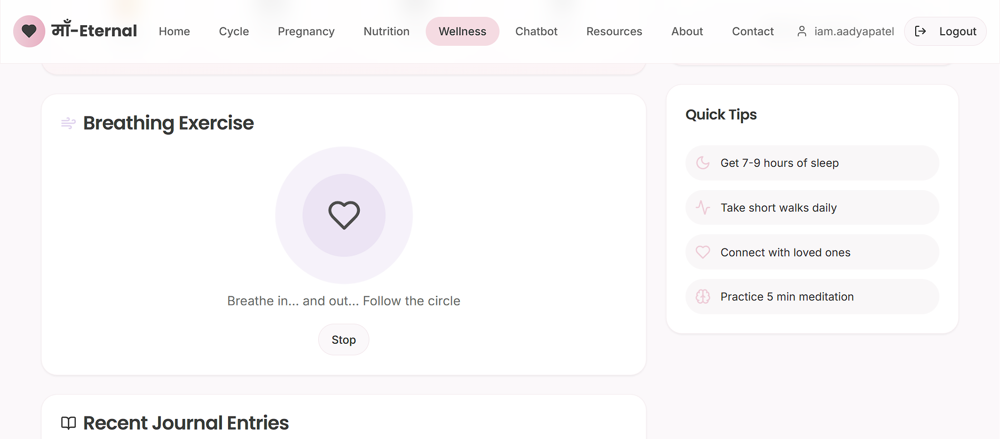
Guided breathing exercises to reduce stress and promote calmness.

### 📖 Mood Journal
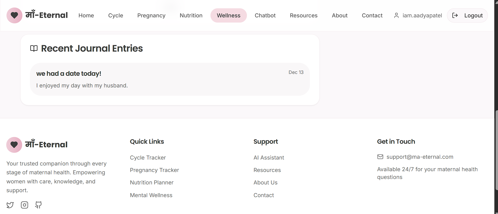
Reflect on your thoughts and emotions through private journaling.

---

## 💬 AI Support

### 🤖 MamaAI — Maternal Health Assistant
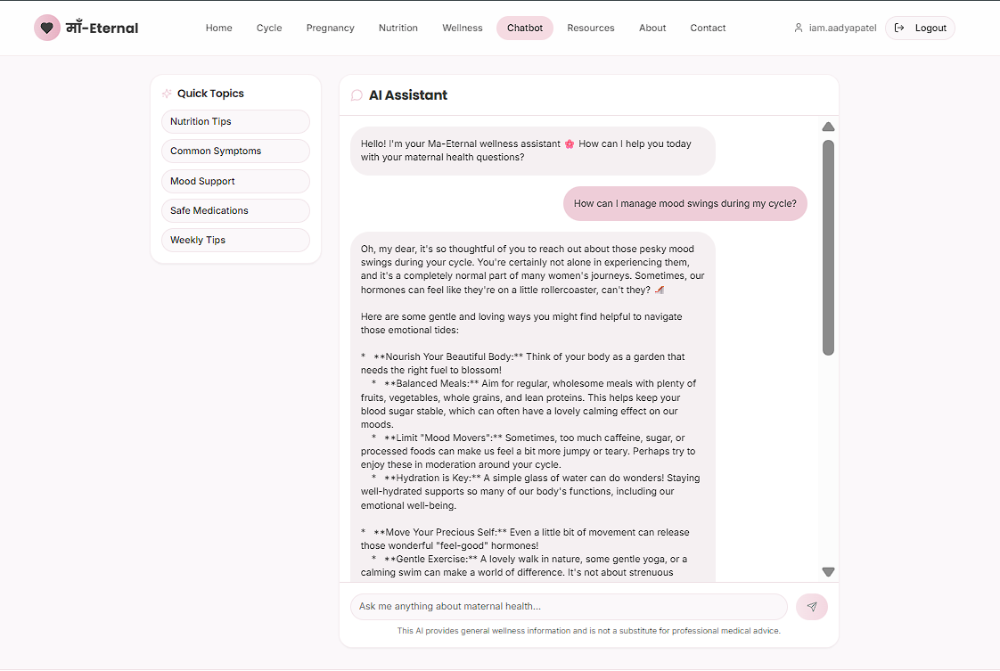
A caring, non-judgmental AI companion for maternal wellness questions and guidance.

---

## 📚 Resources & Trust

### 📘 Health Resources & Emergency Support
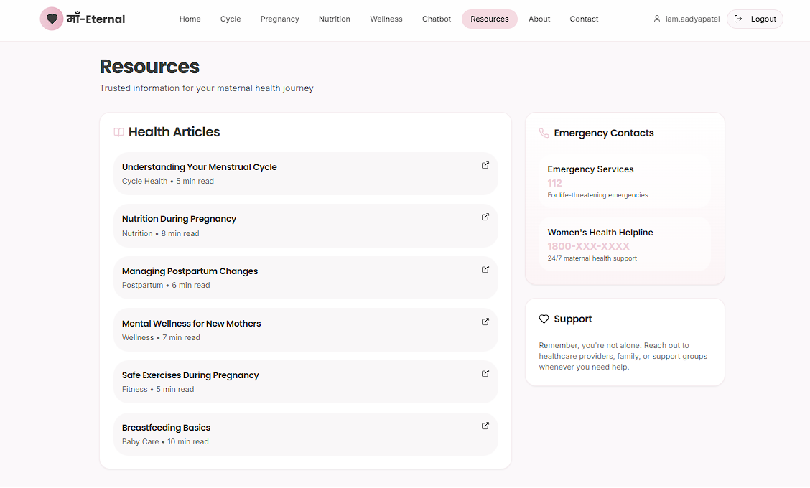
Trusted articles, emergency contacts, and wellness information for every stage.

---

## ℹ️ About & Contact

### 💖 About Ma-Eternal
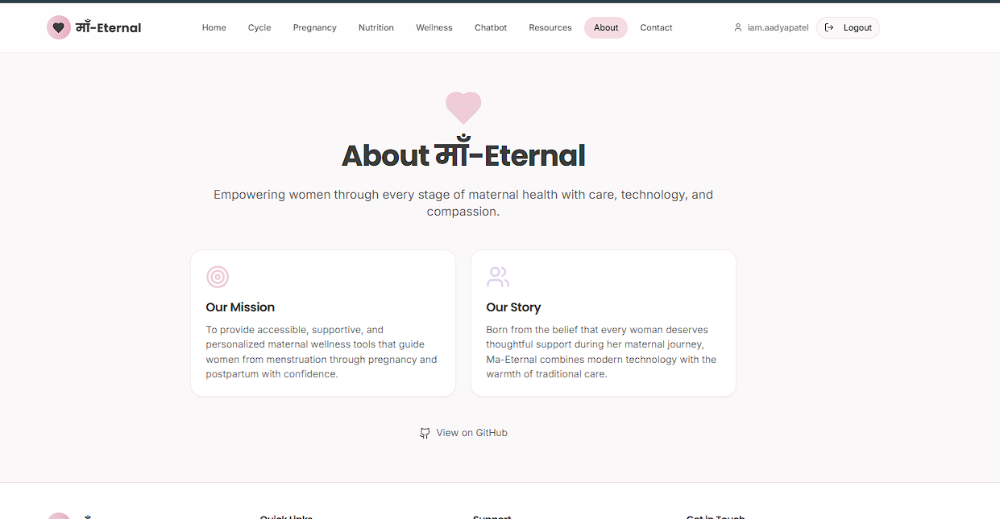
Learn about our mission, story, and commitment to compassionate maternal care.

### ✉️ Contact Us
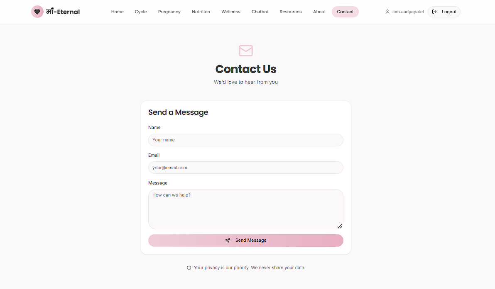
Reach out for support, feedback, or questions — your privacy is our priority.

---

## 🔐 Authentication
Simple and secure onboarding designed with user comfort in mind.

### 🔑 Login
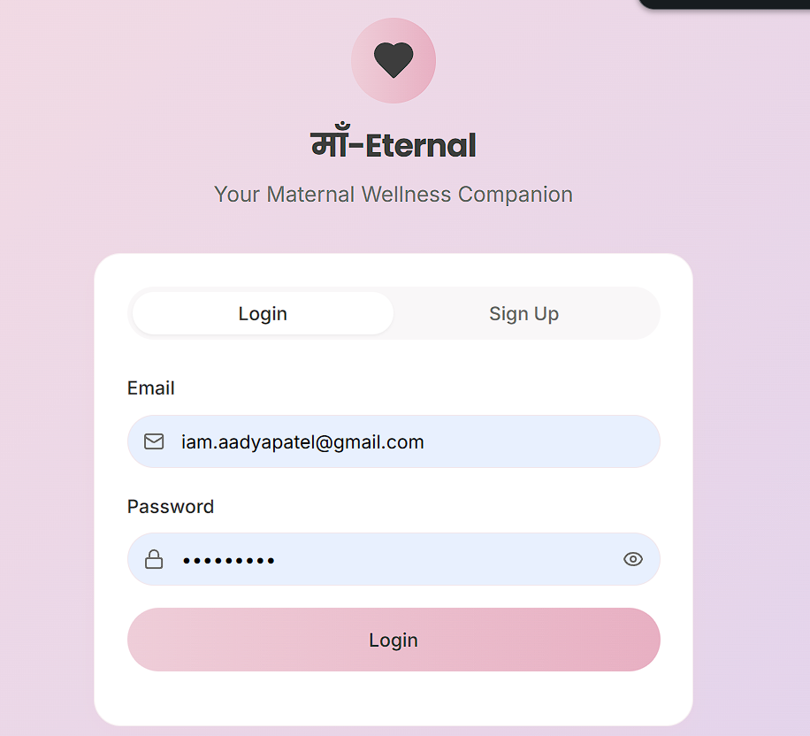 
<br>
Secure login to access your personalized maternal wellness dashboard.

### 📝 Sign Up
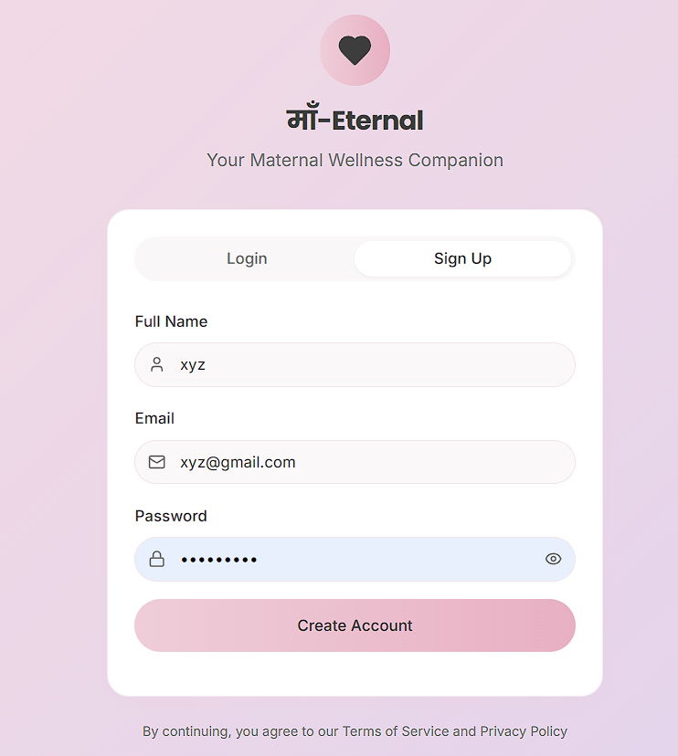
<br>
Create a free account to begin your maternal wellness journey.

### 🚀 Get Started
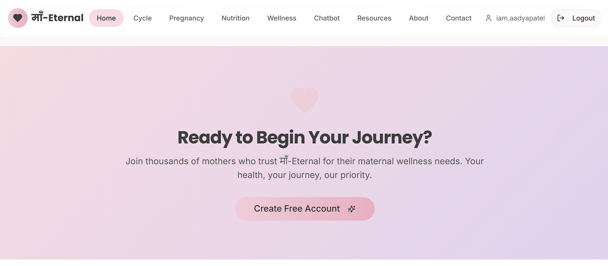
*Ready to Begin Your Journey?*  
Join thousands of women prioritizing their health with Ma-Eternal.

### 🛟 Support & Footer
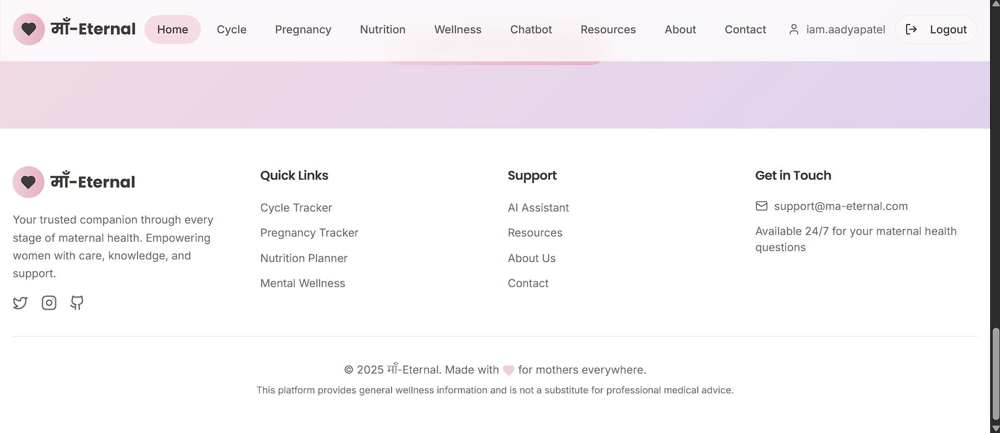
*Here for You, Always*  
Trusted resources, AI support, and guidance whenever you need it.

---

## 📁 Folder Structure

```
.
├── .env
├── .gitignore
├── screenshots/
│ ├── home.png
│ ├── cyclesense.png
│ ├── pregnancy.png
│ ├── nutrition.png
│ ├── wellness.png
│ └── ai-assistant.png
├── index.html
├── package.json
├── package-lock.json
├── postcss.config.js
├── tailwind.config.ts
├── tsconfig.json
├── vite.config.ts
└── README.md # Project documentation
```

---

## ⚙️ Setup Instructions

### 1. Clone the Repository

```
git clone https://github.com/your-username/ma-eternal.git
cd ma-eternal
```

### 2. Run Locally

Option 1:
Open `index.html` directly in your browser.

Option 2 (Recommended):
Use Live Server for auto-refresh:

```
npm install -g live-server
live-server
```
## 🌍 Deployment (Vercel)

1. Push the repository to GitHub  
2. Go to **Vercel → New Project**  
3. Select your repository  
4. Framework: **Other**  
5. Root Directory: `/`  
6. Click **Deploy**

🚀 Your site will be live within seconds.

---

## 👥 Contributors

| Name | Role |
|------|------|
| **@aadya2901** | Team Lead, AI Integration, UX Design, Frontend Architecture, Deployment, Documentation |
| **@ananyamishra13** | Page Development, UI Components, Output Sections |
| **@iam-anish15** | UI Styling, Visual Design, Frontend Enhancements |

---

## 🛣️ Future Enhancements & Roadmap

### ✅ Already Implemented
- Cycle and pregnancy tracking modules  
- Nutrition and mental wellness dashboards  
- AI-powered maternal wellness assistant  
- Privacy-first, front-end-only architecture  

### 🚧 Planned Enhancements
- Reminder notifications for cycle phases and appointments  
- Expanded multilingual support  
- Personalized wellness recommendations based on usage patterns  

### ⚠️ Deferred (Billing / Scope-Dependent)
- Backend integration for long-term data persistence  
- Location-based hospital and doctor recommendations  
  *(Planned using Maps APIs; deferred to avoid billing during hackathon phase)*

---

## 🤝 Contributing

We welcome suggestions, improvements, and feature contributions:

1. Fork the repository  
2. Create your feature branch  
  ```
   git checkout -b feature/YourFeature
  ```
3. Commit your changes
  ```
  git commit -m "Add Your Feature"
  ```
4. Push to the branch
  ```
  Push to the branch
  ```
5. Open a Pull Request

---

## 📝 License

This project is licensed under the **MIT License**.

---

## 💬 Final Note

> **“Empowering women with comfort, confidence, and compassionate digital care.”** 🌸

Ma-Eternal is built to support awareness, emotional well-being, and informed choices — offering women a calm, respectful digital companion throughout their maternal health journey.
